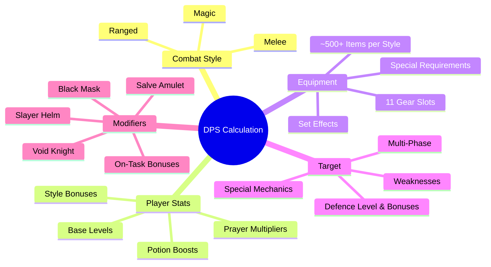
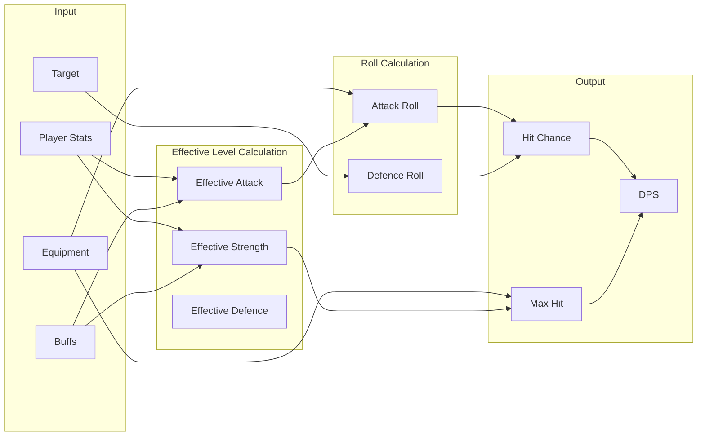
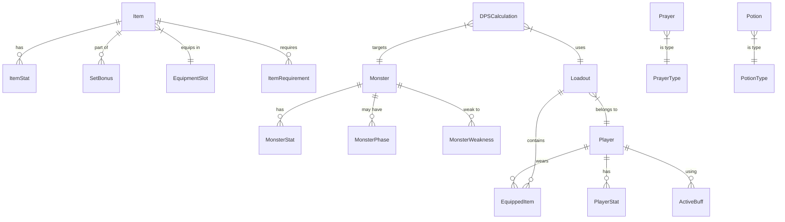
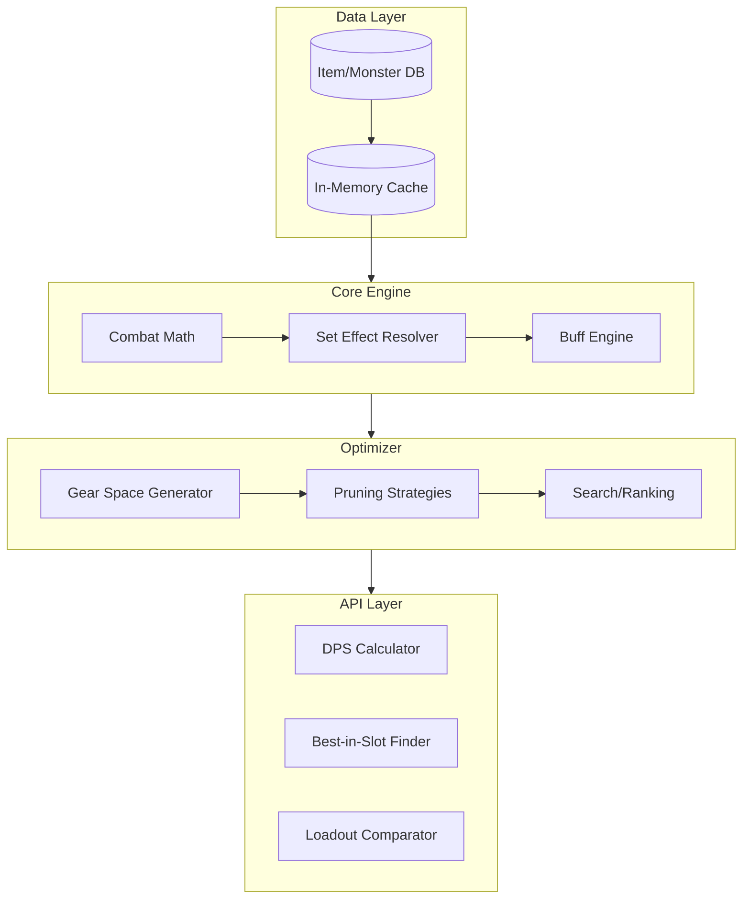
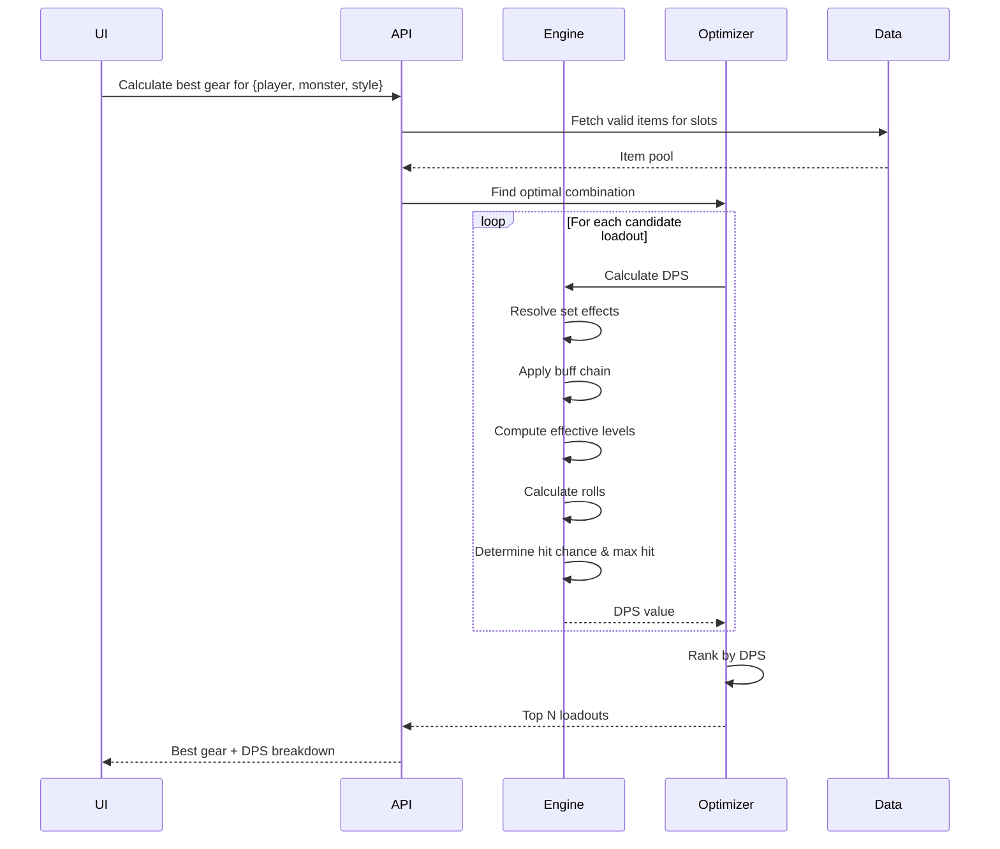
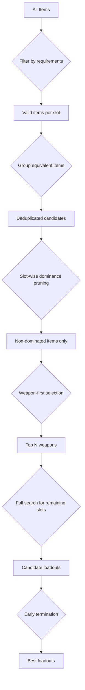
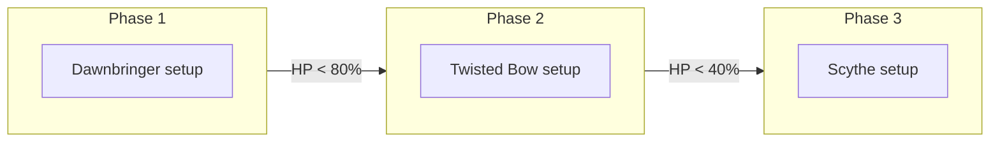

# Conversation with Claude

**Date:** 2026-01-09
**Source:** [claude.ai](https://claude.ai/chat/e34ac566-7b78-452a-bb20-082996ab9d22)

---

### **You**

How would you go about recreating this tool: <https://gearscape.net/calculators/best/>. It's very complex in terms of all the items and combinations and monsters. How would you model this effectively? How should we go about planning this if we were to first implement an extensible MVP. Let's first think carefully about data modelling elegantly and for extensibility, formulas and mathematics and go from there. Mermaid diagrams might help explain too. Eventually we'll want to support a things such as multi-phase boss fights.

---

### **Claude**

# OSRS Best-in-Slot Gear Optimizer — Technical Design

## Executive Summary

Building a gear optimization tool like Gearscape's "Best Setup" calculator is a fascinating combinatorial optimization problem. At its core, it needs to:

1. Model OSRS's combat system mathematically
2. Represent thousands of items, monsters, prayers, potions, and their interactions
3. Search through enormous gear combination spaces efficiently
4. Handle edge cases like set effects, multi-phase bosses, and special attacks

This document provides a complete technical blueprint for an extensible MVP.

---

## 1. Understanding the Problem Domain

### 1.1 What Does "Best" Mean?

The optimizer finds gear that maximizes **DPS** (Damage Per Second) against a specific target. The core formula:

```
DPS = hit_chance × average_hit / attack_interval

where:
  hit_chance ∈ [0, 1]           — probability of landing a hit
  average_hit = max_hit / 2     — expected damage when hit lands (uniform distribution 0 to max_hit)
  attack_interval = ticks × 0.6 — time between attacks in seconds
```

### 1.2 The Complexity Iceberg

What seems like a simple max-hit calculator actually involves:



---

## 2. Core Mathematics

### 2.1 The DPS Pipeline



### 2.2 Effective Level Formula (Melee Example)

```
effective_level = floor(
    floor(
        floor(base_level + potion_boost) × prayer_multiplier
    ) + style_bonus + 8
)
```

**Prayer Multipliers (examples):**

| Prayer | Attack | Strength |
|--------|--------|----------|
| Piety | 1.20 | 1.23 |
| Chivalry | 1.15 | 1.18 |
| Ultimate Strength | 1.15 | 1.15 |

**Style Bonuses:**

| Style | Attack Bonus | Strength Bonus |
|-------|-------------|----------------|
| Accurate | +3 | +0 |
| Aggressive | +0 | +3 |
| Controlled | +1 | +1 |
| Defensive | +0 | +0 |

### 2.3 Attack & Defence Rolls

```
max_attack_roll = effective_attack × (equipment_attack_bonus + 64)
max_defence_roll = effective_defence × (equipment_defence_bonus + 64)
```

### 2.4 Hit Chance

```python
def hit_chance(attack_roll: int, defence_roll: int) -> float:
    if attack_roll > defence_roll:
        return 1 - (defence_roll + 2) / (2 * (attack_roll + 1))
    else:
        return attack_roll / (2 * (defence_roll + 1))
```

### 2.5 Max Hit (Melee)

```
base_max_hit = floor(0.5 + effective_strength × (str_bonus + 64) / 640)
final_max_hit = floor(base_max_hit × gear_multiplier × special_multiplier)
```

**Gear Multipliers (multiplicative chain):**

| Source | Multiplier | Condition |
|--------|-----------|-----------|
| Void Melee | 1.10 | Full set |
| Slayer Helm (i) | 1.1667 | On-task |
| Salve (ei) | 1.20 | Undead target |
| Berserker Necklace | 1.20 | With obsidian weapon |

**Note:** Slayer helm and Salve amulet do **not** stack.

---

## 3. Data Modelling

### 3.1 Core Entity Relationships



### 3.2 Item Schema

```typescript
interface Item {
  id: number;
  name: string;
  slot: EquipmentSlot;
  
  // Combat stats
  attackBonuses: AttackBonuses;
  defenceBonuses: DefenceBonuses;
  otherBonuses: OtherBonuses;
  
  // Meta
  requirements: Requirement[];
  setId?: string;          // For set effects
  isTwoHanded?: boolean;
  attackSpeed?: number;    // In game ticks
  combatStyle?: CombatStyle;
  
  // Special properties
  specialEffects?: SpecialEffect[];
}

interface AttackBonuses {
  stab: number;
  slash: number;
  crush: number;
  magic: number;
  ranged: number;
}

interface OtherBonuses {
  meleeStrength: number;
  rangedStrength: number;
  magicDamage: number;  // Percentage
  prayer: number;
}

type EquipmentSlot = 
  | 'head' | 'cape' | 'neck' | 'ammo' | 'weapon'
  | 'body' | 'shield' | 'legs' | 'hands' | 'feet' | 'ring';
```

### 3.3 Monster Schema

```typescript
interface Monster {
  id: number;
  name: string;
  
  // Combat stats
  hitpoints: number;
  attackLevel: number;
  strengthLevel: number;
  defenceLevel: number;
  magicLevel: number;
  rangedLevel: number;
  
  // Defence bonuses (determines accuracy against it)
  defenceBonuses: DefenceBonuses;
  
  // Special properties
  attributes: MonsterAttribute[];  // 'undead', 'demon', 'dragon', 'slayer', etc.
  immunities: DamageType[];
  weaknesses: Weakness[];
  
  // Multi-phase support
  phases?: MonsterPhase[];
  
  // Combat behavior (for advanced simulation)
  attackSpeed?: number;
  attackStyles?: AttackStyle[];
}

interface MonsterPhase {
  id: string;
  name: string;
  
  // Override stats for this phase
  statOverrides: Partial<MonsterStats>;
  defenceBonusOverrides?: Partial<DefenceBonuses>;
  
  // Phase-specific mechanics
  damageReduction?: number;       // e.g., Tekton's 75% reduction when enraged
  immuneTo?: DamageType[];
  weakTo?: DamageType[];
  
  // Duration/transition
  duration?: number;              // Ticks, if timed
  transitionCondition?: string;   // e.g., "below_50_hp", "after_n_attacks"
  healthThreshold?: number;       // For HP-based transitions
}

type MonsterAttribute = 
  | 'undead' | 'demon' | 'dragon' | 'kalphite' | 'slayer'
  | 'leafy' | 'shade' | 'vampyre' | 'wilderness';
```

### 3.4 Buff System (Prayers, Potions, Effects)

```typescript
interface Buff {
  id: string;
  name: string;
  type: BuffType;
  
  // Stat modifications
  effects: BuffEffect[];
  
  // Constraints
  exclusive?: string[];  // IDs of buffs this can't stack with
  requirements?: Requirement[];
}

interface BuffEffect {
  stat: StatType;
  operation: 'add' | 'multiply' | 'set';
  value: number;
  
  // When does this apply?
  phase?: 'base' | 'effective' | 'final';  // Order matters!
  condition?: EffectCondition;
}

type BuffType = 'prayer' | 'potion' | 'spell' | 'passive' | 'set_effect';

// Example: Super Combat Potion
const superCombatPotion: Buff = {
  id: 'super_combat',
  name: 'Super Combat Potion',
  type: 'potion',
  effects: [
    { stat: 'attack', operation: 'add', value: 5, phase: 'base' },
    { stat: 'attack', operation: 'multiply', value: 1.15, phase: 'base' },
    { stat: 'strength', operation: 'add', value: 5, phase: 'base' },
    { stat: 'strength', operation: 'multiply', value: 1.15, phase: 'base' },
    { stat: 'defence', operation: 'add', value: 5, phase: 'base' },
    { stat: 'defence', operation: 'multiply', value: 1.15, phase: 'base' },
  ]
};
```

### 3.5 Set Effects

Set effects are gear synergies that only activate when wearing specific combinations:

```typescript
interface SetBonus {
  id: string;
  name: string;
  
  // What items make up this set?
  requiredItems: SetRequirement[];
  
  // What bonus do you get?
  effects: SetEffect[];
}

interface SetRequirement {
  // Option A: specific item IDs
  itemIds?: number[];
  
  // Option B: any item from a group (for variants)
  anyOf?: number[];
  
  // How many needed for partial bonuses
  threshold?: number;
}

interface SetEffect {
  // Stat modifications
  statEffect?: BuffEffect;
  
  // Special mechanics
  specialEffect?: SpecialMechanic;
  
  // Only at certain thresholds
  minPieces?: number;
}

// Example: Void Knight
const voidKnightMelee: SetBonus = {
  id: 'void_melee',
  name: 'Void Knight (Melee)',
  requiredItems: [
    { anyOf: [VOID_MELEE_HELM_ID] },
    { anyOf: [VOID_TOP_ID, ELITE_VOID_TOP_ID] },
    { anyOf: [VOID_ROBE_ID, ELITE_VOID_ROBE_ID] },
    { itemIds: [VOID_GLOVES_ID] },
  ],
  effects: [
    { 
      statEffect: { stat: 'attack', operation: 'multiply', value: 1.10, phase: 'final' },
      minPieces: 4 
    },
    { 
      statEffect: { stat: 'strength', operation: 'multiply', value: 1.10, phase: 'final' },
      minPieces: 4 
    },
  ]
};
```

---

## 4. Architecture Overview

### 4.1 System Components



### 4.2 Calculation Pipeline (Detailed)



---

## 5. Optimization Strategy

### 5.1 The Combinatorial Challenge

With ~11 equipment slots and potentially 50+ valid items per slot:

```
Naive combinations = 50^11 ≈ 48.8 quadrillion combinations
```

This is computationally infeasible. We need smart pruning.

### 5.2 Pruning Strategies



**Pruning Techniques:**

1. **Requirement Filtering**: Skip items player can't equip
2. **Dominance Pruning**: If item A is strictly worse than B in all stats, discard A
3. **Weapon-First**: Weapons dominate DPS; enumerate top weapons first
4. **Set Awareness**: Group set pieces together
5. **Memoization**: Cache effective level and roll calculations
6. **Early Termination**: Stop if remaining slots can't improve on current best

### 5.3 Efficient Search Algorithm

```typescript
interface OptimizationContext {
  player: PlayerStats;
  monster: Monster;
  combatStyle: CombatStyle;
  constraints: GearConstraints;  // Locked items, budget, etc.
}

function findBestGear(ctx: OptimizationContext): Loadout[] {
  const validItems = filterByRequirements(ctx);
  const prunedItems = dominancePrune(validItems);
  
  // Weapon is most impactful - enumerate top weapons
  const topWeapons = rankWeapons(prunedItems.weapon, ctx).slice(0, 10);
  
  const results: ScoredLoadout[] = [];
  
  for (const weapon of topWeapons) {
    // With weapon fixed, enumerate other slots
    const searchSpace = buildSearchSpace(prunedItems, weapon, ctx);
    
    // Use beam search or branch-and-bound
    const best = beamSearch(searchSpace, ctx, {
      beamWidth: 100,
      scoreFunction: (loadout) => calculateDPS(loadout, ctx),
    });
    
    results.push(...best);
  }
  
  return results
    .sort((a, b) => b.dps - a.dps)
    .slice(0, 20);
}
```

---

## 6. Multi-Phase Boss Support

### 6.1 Phase-Weighted DPS

For bosses with multiple phases, we compute **weighted average DPS**:

```typescript
interface BossEncounter {
  monster: Monster;
  phases: EncounterPhase[];
}

interface EncounterPhase {
  phase: MonsterPhase;
  weight: number;  // Fraction of fight time (sums to 1.0)
}

function calculateEncounterDPS(loadout: Loadout, encounter: BossEncounter): number {
  let totalDPS = 0;
  
  for (const { phase, weight } of encounter.phases) {
    const phaseMonster = applyPhaseOverrides(encounter.monster, phase);
    const phaseDPS = calculateDPS(loadout, phaseMonster);
    totalDPS += phaseDPS * weight;
  }
  
  return totalDPS;
}
```

### 6.2 Example: Verzik Vitur

```typescript
const verzikEncounter: BossEncounter = {
  monster: verzikBase,
  phases: [
    {
      phase: {
        id: 'p1',
        name: 'Phase 1 (Dawn\'s Shield)',
        statOverrides: { defenceLevel: 200 },
        immuneTo: ['melee'],  // Only Dawnbringer works
      },
      weight: 0.15,  // Short phase
    },
    {
      phase: {
        id: 'p2', 
        name: 'Phase 2 (Running)',
        statOverrides: { defenceLevel: 150 },
        weakTo: ['ranged'],
      },
      weight: 0.35,
    },
    {
      phase: {
        id: 'p3',
        name: 'Phase 3 (Final)',
        statOverrides: { defenceLevel: 100 },
        // Normal combat
      },
      weight: 0.50,
    },
  ]
};
```

### 6.3 Phase-Specific Gear Switching

Advanced feature: recommend different gear per phase:



---

## 7. MVP Implementation Plan

### 7.1 Phase 1: Core Calculator (Week 1-2)

**Goal:** Calculate DPS for a single loadout against a single monster.

```
Deliverables:
├── Combat math engine
│   ├── Effective level calculation (melee only)
│   ├── Attack/defence rolls
│   ├── Hit chance formula
│   └── Max hit formula
├── Basic data models
│   ├── Item interface
│   ├── Monster interface
│   └── Player stats interface
├── Hardcoded test data
│   └── 10-20 common weapons/armour
└── Unit tests for formulas
```

### 7.2 Phase 2: Data Pipeline (Week 2-3)

**Goal:** Import real item/monster data from OSRS Wiki.

```
Deliverables:
├── Wiki data scraper
│   ├── Item stats extractor
│   └── Monster stats extractor
├── Data normalization
│   ├── Consistent stat naming
│   └── Requirement parsing
├── Persistence layer
│   ├── JSON flat files (MVP)
│   └── SQLite (optional)
└── Cache layer
```

### 7.3 Phase 3: Buff System (Week 3-4)

**Goal:** Handle prayers, potions, and gear effects.

```
Deliverables:
├── Buff engine
│   ├── Effect application order
│   ├── Stacking rules
│   └── Exclusive buff handling
├── Prayer definitions
├── Potion definitions
└── Integration tests
```

### 7.4 Phase 4: Set Effects (Week 4-5)

**Goal:** Handle Void, Inquisitor's, etc.

```
Deliverables:
├── Set detection system
├── Set effect definitions
├── Partial set bonuses
└── Set + non-set interaction tests
```

### 7.5 Phase 5: Optimizer (Week 5-7)

**Goal:** Find best gear combinations.

```
Deliverables:
├── Gear space enumeration
├── Pruning strategies
├── Search algorithm
├── Constraint system (locked items, budget)
└── Performance benchmarks
```

### 7.6 Phase 6: Multi-Phase Bosses (Week 7-8)

**Goal:** Support encounters like ToB bosses.

```
Deliverables:
├── Phase definition system
├── Weighted DPS calculation
├── Phase-specific immunity handling
└── Gear switching recommendations
```

---

## 8. Tech Stack Recommendations

### 8.1 For a Rust Core + TypeScript UI

Given your Rust + Python ML work, I'd suggest:

```
Backend (Rust):
├── Core math engine (no_std compatible for WASM)
├── Data models with serde
├── Optimizer algorithms
└── WASM bindings for web

Frontend (TypeScript/React):
├── UI components
├── State management
├── WASM integration
└── Visualization (charts)

Data Pipeline (Python):
├── Wiki scraping
├── Data transformation
└── Export to JSON/SQLite
```

### 8.2 Alternative: Pure TypeScript

For faster iteration:

```
TypeScript:
├── Shared core (isomorphic)
├── Next.js or Vite frontend
├── Worker threads for optimization
└── IndexedDB for client-side caching
```

---

## 9. Key Design Decisions

### 9.1 Calculation Order Matters

OSRS uses extensive floor() operations. Order:

```
1. Base stat + potion boost
2. floor()
3. × prayer multiplier  
4. floor()
5. + style bonus + 8
6. × equipment roll
7. Apply gear multipliers (in specific order)
8. floor() after each multiplier
```

### 9.2 Rounding Rules

Always floor (round down) unless specifically documented otherwise. This is critical for accuracy.

### 9.3 Modifier Stacking

```
Salve amulet + Slayer helm:  DO NOT STACK (use better one)
Void + Salve:                DO STACK
Multiple prayers:            ONLY ONE active per type
```

### 9.4 Special Attacks

Out of scope for MVP. They have unique formulas and would require simulation rather than closed-form DPS.

---

## 10. Testing Strategy

### 10.1 Golden Tests

Compare against Bitterkoekje's spreadsheet:

```typescript
describe('DPS Calculator', () => {
  test('max melee setup vs General Graardor', () => {
    const loadout = createLoadout({
      weapon: 'Scythe of vitur',
      helm: 'Torva full helm',
      body: 'Torva platebody',
      // ...
    });
    
    const result = calculateDPS(loadout, graardor, {
      player: { attack: 99, strength: 99 },
      prayers: ['piety'],
      potions: ['super_combat'],
    });
    
    // From Bitterkoekje spreadsheet
    expect(result.dps).toBeCloseTo(10.52, 2);
    expect(result.maxHit).toBe(57);
    expect(result.hitChance).toBeCloseTo(0.8234, 4);
  });
});
```

### 10.2 Property-Based Tests

```typescript
test('DPS increases monotonically with strength bonus', () => {
  fc.assert(fc.property(
    fc.integer({ min: 0, max: 200 }),
    fc.integer({ min: 0, max: 200 }),
    (strBonus1, strBonus2) => {
      if (strBonus1 <= strBonus2) {
        const dps1 = calculateDPS(withStrBonus(strBonus1));
        const dps2 = calculateDPS(withStrBonus(strBonus2));
        return dps1 <= dps2;
      }
      return true;
    }
  ));
});
```

---

## Appendix A: Full Stat List

```typescript
interface FullStats {
  // Attack bonuses
  stabAttack: number;
  slashAttack: number;
  crushAttack: number;
  magicAttack: number;
  rangedAttack: number;
  
  // Defence bonuses
  stabDefence: number;
  slashDefence: number;
  crushDefence: number;
  magicDefence: number;
  rangedDefence: number;
  
  // Other
  meleeStrength: number;
  rangedStrength: number;
  magicDamagePercent: number;
  prayer: number;
  
  // Weapon-specific
  attackSpeed: number;  // Game ticks
  attackRange: number;  // Tiles
}
```

## Appendix B: Magic Damage Formulas

Magic is more complex:

```
base_max_hit = spell_max_hit  (defined per spell, e.g., Fire Surge = 24)

final_max_hit = floor(base_max_hit × (1 + magic_damage_bonus/100))

// With Tome of Fire for fire spells:
final_max_hit = floor(base_max_hit × 1.5 × (1 + magic_damage_bonus/100))
```

## Appendix C: Ranged Formulas

Similar to melee with ranged equivalents:

```
effective_ranged = floor((base + potion) × prayer) + style_bonus + 8
max_hit = floor(0.5 + effective_ranged × (ranged_str + 64) / 640)
attack_roll = effective_ranged × (ranged_attack_bonus + 64)
```

---

## Next Steps

1. **Validate formulas** against existing calculators
2. **Set up project structure** (recommend Rust + WASM or TypeScript)
3. **Build data pipeline** for Wiki import
4. **Implement Phase 1** MVP calculator
5. **Iterate** based on testing

This architecture is designed for extensibility — adding new combat styles, items, or boss mechanics should require only data changes and perhaps new effect handlers, not core rewrites.

---
